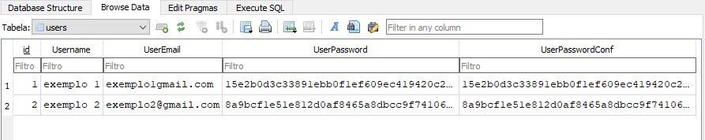

    

#

# Sistema de login e cadastro usando Python e SQLite3

#### Um sistema de login e cadastro. Ele usa fundamentalmente a linguagem Python e SQlite3 como banco de dados.

# Introdução

Este projeto apresenta uma solução simples e eficiente para implementarmos um sistema de login e cadastro com facilidade. 
Usamos a biblioteca *CustomTKinter* para criarmos a interface do sistema, usamos várias funções do CustomTKinter para darmos um rosto a nossa aplicação. 
Para o sistema de banco de dados, usamos a linguagem *Python* e o *SQLite3*, onde trabalhamos com várias funções em nosso sistema.
E finalmente, usando o *hashlib* fizemos um sistema que faz a criptografia das senhas dos usuários, garantindo uma certa segurança quando trabalhamos com nosso banco de dados.

# Funcionalidades

* #### Cadastro de Usuários: 
   Permite que novos usuários se cadastrem no sistema com validação de dados, impedindo nomes de usuários duplicados, senhas pequenas e etc. 
   Acesse diretamente o vídeo no YouTube de como funciona o cadastro de usuários e o banco de dados [aqui](https://youtu.be/rsVSY0c1MCM?si=g-8UxsoO0w8AmlxR).
   Os vídeos também podem ser encontrados em `../login_system/static/videos..`.

* #### Login de Usuários: 
   Autenticação de usuários cadastrados, validando o nome de usuário e a senha e assim liberando o seu acesso.
   Acesse diretamente o vídeo no YouTube para ver como funciona o login de usuários [aqui](https://youtu.be/LRzlxlElqAE?si=dwNsddA_pemRrT-p).
   Os vídeos podem ser encontrados em `../login_system/static/videos..`.

* #### Armazenamento Seguro: 
   Usando o `sha256` da bliblioteca `hashlib`, nós criptografamos as senhas dos usuários antes de enviar as informações ao banco de dados. Assim que o usuário que o tenta fazer login e as informações coincidem, a senha é descriptografada e autenticada, liberando assim, o login do usuário.

# Tecnologias utilizadas

- **FrontEnd usando a biblioteca:** [*CustomTkinter*](https://github.com/TomSchimansky/CustomTkinter)
- **Principal linguagem usada:** [*Python*](https://www.python.org/)
- **Banco de dados usado:** [*SQLite3*](https://www.sqlite.org/index.html)
- **Criptografia de senhas:** [*hashlib*](https://docs.python.org/3/library/hashlib.html)

# Pré-requisitos

##### Antes de começar, você vai precisar ter instalado em sua máquina as ferramentas básicas, como:

- [Python 3](https://www.python.org/) como principal linguagem.
- [Pip](https://pip.pypa.io/en/stable/) para instalar as dependências.
- Para manipular o código é interessante ter um editor, como [VSCode](https://code.visualstudio.com/).
- Para manipular o banco de dados, instale o [SQLite3](https://www.sqlite.org/).
  
- mais informações em `../about/requirements.txt`

# Instalação e Uso

##### Após instalar os requisitos minimos, siga estes passos:

### Instalação

1. Clone o repositório:
   ~~~bash
   git clone https://github.com/igorgp06/login_system.git
   ~~~

2. Crie um ambiente virtual (opcional, porém recomendado):
   ~~~Bash
   python -m venv venv
   source venv/bin/activate  # Para Linux/macOS
   venv\Scripts\activate      # Para Windows
   ~~~

3. Instale as dependências:
   ~~~bash
   pip install -r requirements.txt
   ~~~~

### Execução

1. Navegue até o diretório do projeto:
   ~~~Bash
   cd login_system
   ~~~
2. Execute o script principal:
   ~~~Bash
   python main.py
   ~~~

Lembre-se, os vídeos de como funciona o sistema de login, cadastro e como abrir o banco de dados podem ser encontrados no []em `../login_system/static/videos..` 

# Detalhes Técnicos
#### Aqui vai estar os pricipais detalhes técnicos do sistema, explicando como a tabela está dividida, como a criptografia funciona neste código e os datalhes de como funciona a validação dos dados e capturas de possiveis erros nos sistema.

   ### Estrutura do Banco de Dados

   O Banco de Dados está estruturado em cinco (5) seções, sendo elas:

   id | Username | UserEmail | UserPassword | UserPasswordConf
   :-:|:--------:|:---------:|:------------:|:--------------:
   1  | exemplo 1 | exemplo1@exemplo.com | (criptografada) | (criptografada)
   2  | exemplo 2 | exemplo2@exemplo.com | (criptografada) | (criptografada)

   **No SQLite3 você vai ver isto:**

   

      
   

   **Tabela `users`** - Tabela criada para armazenar os dados dos usuários.
   **ID** - Responsável por gerar um número de identificação pro usuário em ordem       crescente.
   **Username** - Nome que o usuário escolheu e será usado para o efetuar o login.  
   **UserEmail** - Email do usuário, não possui validação.  
   **UserPassword** - Senha criptografada do usuário.  
   **UserPasswordConf** - Confirmação da senha do usuário, ela também é criptografada.

   ### Criptografia

   começaremos importar a biblioteca [hashlib](https://docs.python.org/3/library/hashlib.html) e em seguida criaremos uma `def` que criptografa as senhas dos usuários. Chamamos esta função antes de enviar as informações para o banco de dados, ou seja, as senhas são criptografadas assim que o cadastro é aceito enviando informações mais seguras para o banco de dados.

   ~~~python
   # função para criptografar as senhas
    def hash_password(self, password):
        # criação dos hashs das senhas
        return hashlib.sha256(password.encode()).hexdigest()
   ~~~
   ~~~python
   # salvando as entrys em variáveis criptografadas
   hashed_password = self.hash_password(self.cad_userpassword_entry_get)
   hashed_password_conf = self.hash_password(self.cad_userpassword_conf_entry_get)
   ~~~
   ~~~python
   # Inserindo os dados e as senhas criptografadas na tabela
   self.cursor.execute("""
      INSERT INTO users (Username, UserEmail, UserPassword, UserPasswordConf)
       VALUES (?, ?, ?, ?)""", (self.cad_username_entry_get,
                                self.cad_useremail_entry_get,
                                hashed_password,
                                hashed_password_conf))    
   ~~~

   ### Validação dos dados

   **Usamos** `try` `except` **e** `finally` **para capturarmos erros.**
   Usando o `try` e `if` para capturar erros de cadastro do usuário, onde não é permitido nomes de usuários duplicados, senhas pequenas e etc.

   ~~~python
   try:
      # Verificando se os dados foram inseridos corretamente
      if (self.cad_username_entry_get == "" 
            or self.cad_useremail_entry_get == ""
            or self.cad_userpassword_entry_get == ""
            or self.cad_userpassword_conf_entry_get == ""):
            messagebox.showerror(title="Erro 001",
                              message="Favor, preencha todos os campos com as devidas informações!")
            return
            
      if (len(self.cad_username_entry_get) < 4):
            messagebox.showerror(title="Erro 002", 
                              message="O seu nome de usuário deve conter pelo menos 4 caracteres!")
            return

      if (self.cad_userpassword_entry_get != self.cad_userpassword_conf_entry_get):
            messagebox.showerror(title="Erro 003", 
                              message="As senhas inseridas devem ser iguais!\nFavor, confirme as senhas novamente.")
            return
            
      if (len(self.cad_userpassword_entry_get) < 5):
            messagebox.showerror(title="Erro 004", 
                              message="As senhas devem conter pelo menos 5 caracteres!")
            return
      
      # Verificando se o nome de usuário existe
      self.cursor.execute("SELECT * FROM users WHERE Username = ?", (self.cad_username_entry_get,))
      existing_user = self.cursor.fetchone()

      if existing_user:
            messagebox.showerror(title="Erro 005",
                                 message="O nome de usuário inserido já existe!\nFavor, escolha outro nome de usuário.")
            return

      # Inserindo os dados na tabela se não ouver nenhum erro
      self.cursor.execute("""
            INSERT INTO users (Username, UserEmail, UserPassword, UserPasswordConf)
            VALUES (?, ?, ?, ?)""", (self.cad_username_entry_get,
                                    self.cad_useremail_entry_get,
                                    hashed_password,
                                    hashed_password_conf))

      self.conn.commit()
      self.clear_cad_entry()
      self.login_page()
      messagebox.showinfo(title="Sucesso!",
                           message=f"Seu usuário '{self.cad_username_entry_get}' foi criado com sucesso!")
   ~~~

   ### Captura de erros
   Aqui apresentarei como os erros são identificados e tradados no projeto, ele usa como base para capturalos `except` e `finally`.

   **Captura de erros no Banco de Dados**
   Usando o primeiro `except` para capturar possiveis erros no banco de dados, onde em nosso terminal ele apresenta uma mensagem de erro e informa qual foi o erro detectado no Banco de Dados.

   ~~~python
   except sqlite3.Error as e:
       print("Erro no banco de dados", e)
       messagebox.showerror(title="Erro 006",
                            message="Ocorreu um erro no banco de dados!\nFavor, tente novamente.")
   ~~~
   **Captura de erros no sistema**
   O último `except` tem  a função de dizer se o erro foi diretamente no sistema, ele apresenta uma mensagem de erro e informa qual foi o erro detectado no sistema.

   ~~~python
   except Exception as e:
       print("Erro inesperado no sistema", e)
       messagebox.showerror(title="Erro 007",
                            message="Ocorreu um erro inesperado no sistema!\nFavor, tente novamente.")
   ~~~
   **Fechando o banco de dados**
   Assim que todas as verificações forem concluídas, o `finally` vai fechar o nosso banco de dados.

   ~~~python
   finally:
       self.db_disconnect()
   ~~~

# Contribuindo

Contribuições são sempre bem-vindas! Sinta-se a vontade para relatar bugs, sugestões e melhorias no [issues](https://github.com/igorgp06/login_system/issues).
Correção de bugs e novas funcionalidades também são sempre muito bem vindas, crie um `pull request` [aqui](https://github.com/igorgp06/login_system/pulls) e ajude-me com suas melhorias e correções.

## Licença e código de Conduta

O projeto Login System esá sujeito a licença [APACHE LICENSE 2.0](https://www.apache.org/licenses/LICENSE-2.0).

Por favor, siga o `NOTICE`, `CODE OF CONDUCT` e leia a `LICENSE` desse projeto. Informações  em `../login_system/about..`

Leia nosso [CODE OF CONDUCT](https://github.com/igorgp06/login_system/blob/master/about/CODE_OF_CONDUCT.md).

## Contato

Para esclarer dúvidas, mandar sugestões ou até mesmo bater um papo comigo, mande um Email para contateme.igorgp@gmail.com!

### Desenvolver responsável

Igor Gonçalves Pinheiro ou [igorgp06](https://github.com/igorgp06)

### Créditos

As imagens usadas no projeto foram retiradas da [storyset](https://storyset.com/illustration/mobile-login/cuate). 

   [login.png](https://storyset.com/illustration/mobile-login/cuate)

   [Signup.png](https://storyset.com/illustration/sign-up/pana)

## Redes Sociais

  
  
  
  
  

## Repository Status

   
   
   

   

   

   

